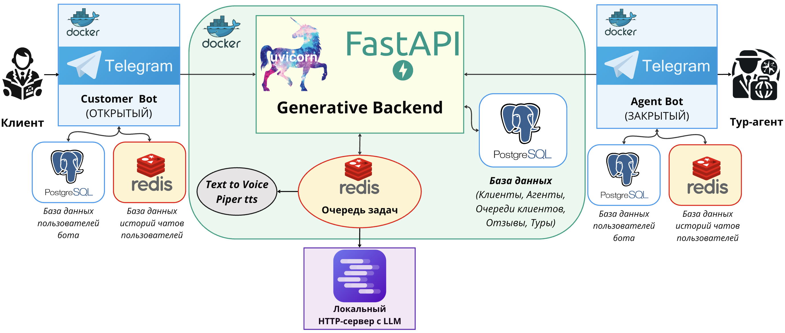
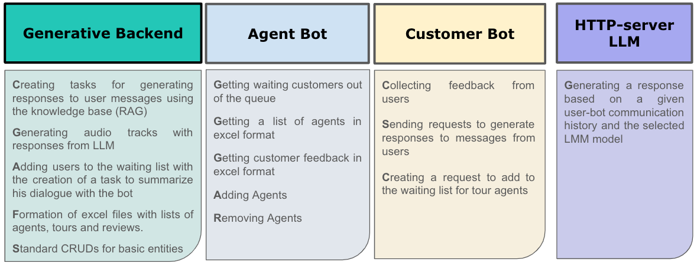

<!-- PROJECT LOGO -->
 

  
   
  <h3 align="center">Contact-Center-Automation-Service</h3>

<!-- TABLE OF CONTENTS -->

  
Table of Contents / Содержание

  <ol>
    <li>
      <a href="#about-the-project--о-проекте">About The Project / О проекте</a>
    </li>
    <li>
      <a href="#getting-started--начало">Getting Started / Начало</a>
    </li>
    <li>
   <a href="#contact--контакты">Contact / Контакты</a>
   </li>
  </ol>

<!-- ABOUT THE PROJECT -->

## About The Project / О проекте

**Main purposes of the service**
* Reduce the cost of maintaining a contact center
* Provide round-the-clock customer service
* Automate typical tasks

**How it works**
* There is a telegram chatbot for customers (Customer Bat) through which they communicate with LLM, 
which uses a knowledge base about a particular business to provide accurate information. 
If desired, customers can sign up in a queue where they will wait for an agent 
(business representative).

* There is a telegram chatbot for agents, through which they can get information about 
a waiting client with a summary of his communication with the bot in order 
to quickly find out about the client's problem. 
There are also special functions for the superagent, 
which is set via a script in the Generative Backend.

* The link between the two bots is the Generative Backend. 
It is necessary for generating content and working with the database.

The service is designed for small businesses, since it is expected that the entire service, 
including LLM, will be deployed on a local machine owned by the business. 
Without the need to use third-party services and computing power. 
This is primarily due to the high prices of third-party products.

The project is based on a _micro-service architecture_

There are 4 main services -
* [Generative Backend](https://github.com/RomiconEZ/GenerativeBackend/tree/dev)
* [Customer Bot](https://github.com/RomiconEZ/CustomerBot)
* [Agent Bot](https://github.com/RomiconEZ/AgentBot)
* [LLM HTTP Server](https://lmstudio.ai)

**Main functions of each of the services**

<!-- GETTING STARTED -->
## Getting Started / Начало

1. Run all services according to the README for each project.

<!-- CONTACT -->
## Contact / Контакты

Roman Neronov:
* email: roman.nieronov@gmail.com / roman.nieronov@mail.ru
* telegram: @Romiconchik

(<a href="#readme-top">back to top</a>)
